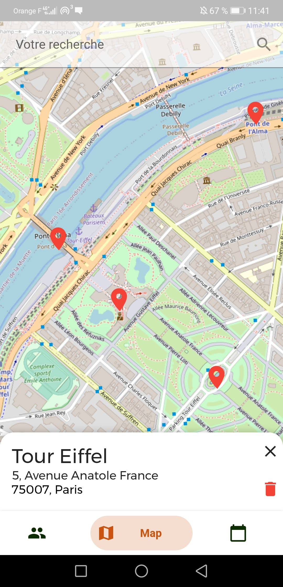
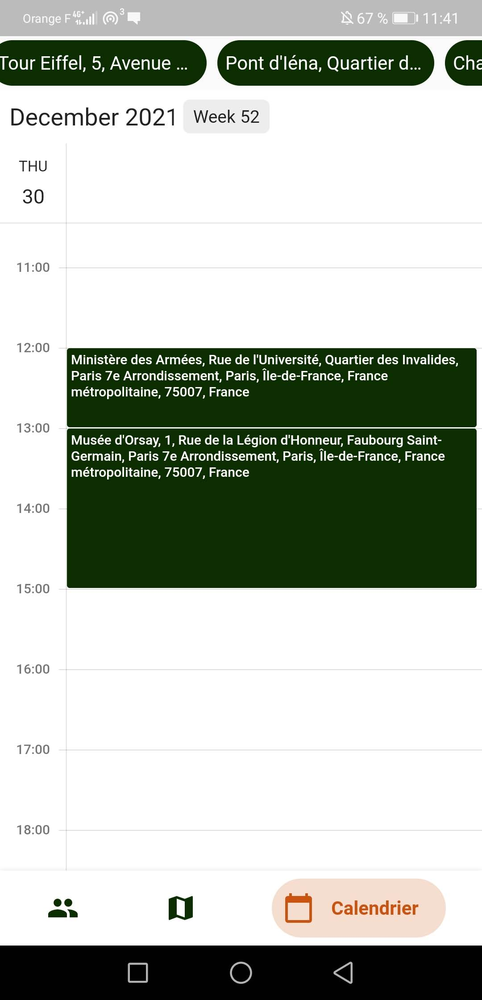
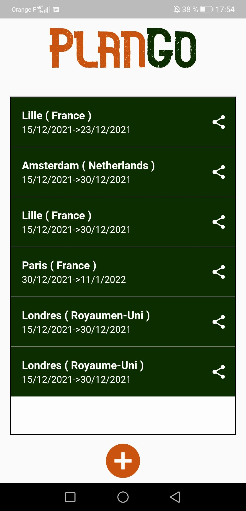
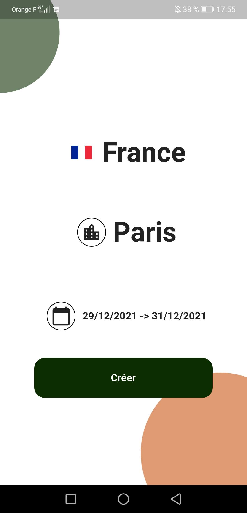
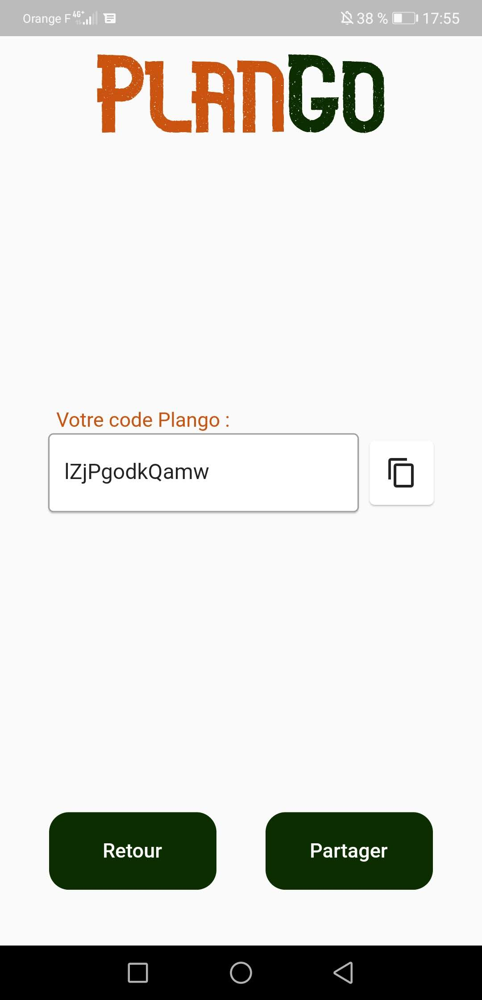

Technologie Mobile
===

Groupe
---

Nous avons gardé le même groupe que pour le projet platine, à savoir
* Gaël Bricout (gael.bricout.etu@univ-lille.fr)
* Annelise Carlier (annelise.carlier.etu@univ-lille.fr)
* Anthony Lafolie (anthony.lafolie.etu@univ-lille.fr)
* Anthony Mendez (anthony.mendez.etu@univ-lille.fr)

Thème projet platine
---
L'idée de notre projet platine est d'aider à la création de voyages en groupe. Nos principales fonctionnalités étaient une carte partagée sur laquelle l'utilisateur ajoute un "pin" qui permet de notifier aux autres membres du groupe l'activité qu'il veut faire (voir ci-dessous).

Ensuite, les activités sont répertoriées dans un calendrier partagé, sur lequel les utilisateurs peuvent organiser leur voyage (voir ci-dessous).

Sujet
---

Le but ici est de créer une partie de l'application faite au projet platine.  
Nous avons décidé de reproduire l'étape de création et de partage de voyage en Angular, car nous avions fait notre projet en Flutter. Nous avons également choisi de garder le même environnement Back-end.

  

Voici les screenshot de cette partie sur l'application flutter:

La liste de voyage

La création d'un voyage

Le partage d'un voyage

Manuel d'installation
---

Ajouts Mobile
---

* Application en ligne via le lien : inchallah
* Chargement des *composants* sur la liste pour les lentes connexion (voir a quoi ressemble l'application alors que les composants ne sont pas encore chargés)
* Completement mobile, autant utilisable sur mobile que sur ordinateur
* Données stockées en locale lors du premier chargement (pour la liste des voyages), permettant de ne pas avoir à rechercher les données dans l'api au prochain chargement
* Utilisation de Angular Material vu en cours
* Gestion de l'accessibilité pour personnes malvoyantes :
 * Couleurs choisies avec un contraste élevé pour tout distinguer sans problème.
 * Ajout de balises title et alt sur chaque textes et images
